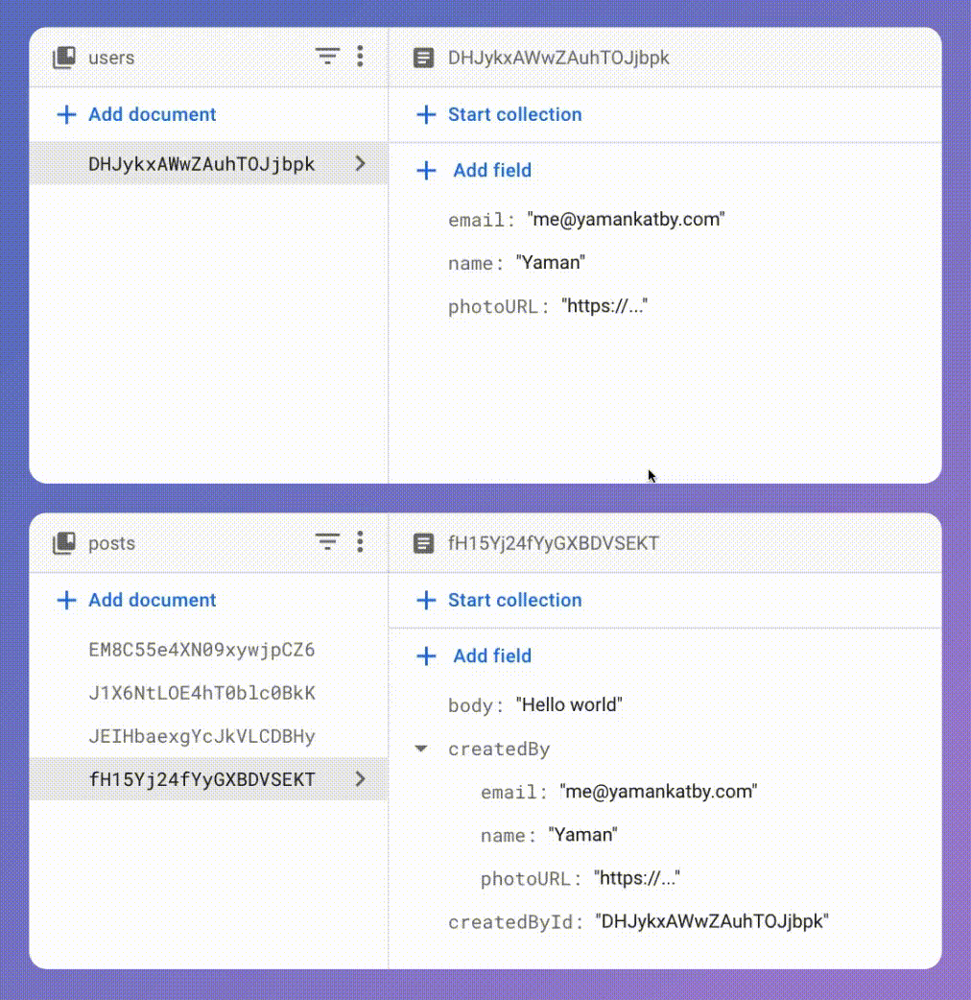

Use this extension to effortlessly automate keeping denormalized data in sync across multiple documents in Firestore, streamlining the management of data and reducing the risk of data inconsistencies.

Denormalized data refers to duplicating data across multiple documents or collections to optimize query performance. For example, you can store a user's name and their photo URL in each `post` document to display the user's information in the post view without making a separate query to the `users` collection.

When a document is created or updated in the **source collection (users)**, this extension will:

- Search for all documents in the **target collection (posts)** that have a **ref field (createdById)** that points to the created/updated document in the **source collection (users)**.
- Add/Update the **data field (createdBy)** in the target documents with the data from the created/updated document in the **source collection (users)**.

> Note: The list of the fields to sync (name, email, photoUrl) is configurable.

Additionally, you can configure what happens when a document is deleted in the **source collection (users)**:

- Delete the target document(s).
- Delete the **data field (createdBy)** in the target document(s).
- Set the **data field (createdBy)** in the target document(s) to `null`.
- Ignore (do nothing).

#### Additional setup

Before installing this extension, make sure that you've [set up a Cloud Firestore database](https://firebase.google.com/docs/firestore/quickstart) in your Firebase project.

#### Billing

This extension uses other Firebase or Google Cloud Platform services which may have associated charges:

- Cloud Firestore

- Cloud Functions (Node.js 10+ runtime. [See FAQs](https://firebase.google.com/support/faq#extensions-pricing)
